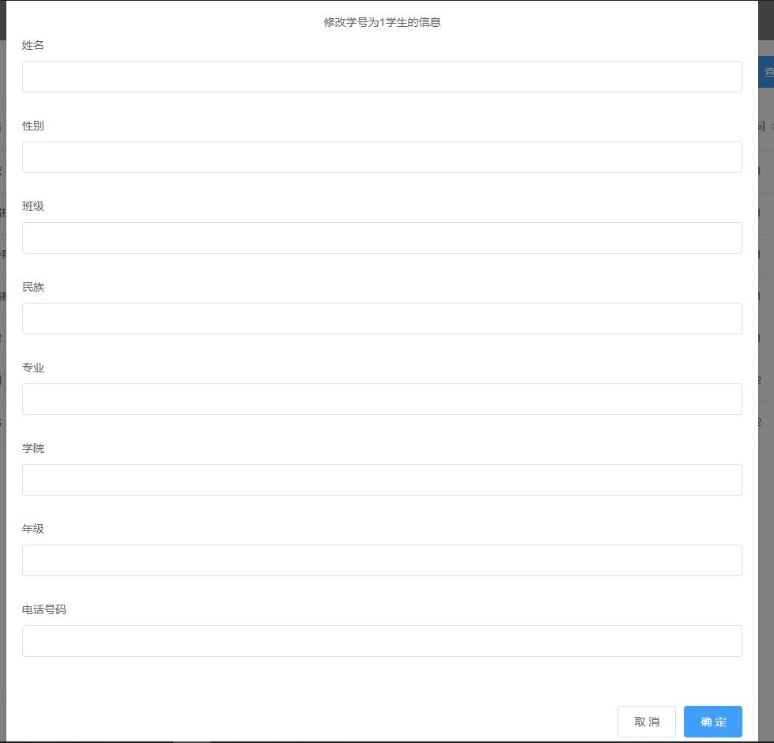

## 1. 概述

### 1.1 系统开发的背景

传统的手工学生宿舍分配，操作过于繁琐及复杂，在大数据量的情况下，执行效率低，并且易于出错。通过使用由数据库进行管理的学生宿舍分配系统，我们可以做到信息的快速操作，实现了学生宿舍分配的系统化、规范化和自动化，这样不仅减少了管理工作量，还提高了管理效率，降低了管理成本。

### 1.2 系统开发的意义

学生宿舍分配系统是学校后勤管理中不可缺少的部分，使用计算机和数据库技术作为管理的核心，能有效的提高工作效率，具有手工操作无法比拟的性能，比如：查询方便，住宿信息便于修改，对学生及宿舍的信息能够长期的保存。这些优点正是开发本系统的意义所在，因此它的内容对于学校的管理有着不可或缺的作用。

### 1.3 系统开发工具

- MySQL
- Visual Studio Code
- Node.js

### 1.4 系统开发框架

采用MVVM模式，通过前后端分离的方式，完成了系统的设计。

- 前端：Vue.js
- 后端：Node.js(express框架)
- 数据库：MySQL

## 2. 需求分析

### 2.1 功能需求

本系统的功能应该包括：

1. 学生基本信息管理：学生基本信息添加、修改、查询、删除；
   
> 管理员可以向数据库中添加学生，修改学生的信息、根据输入的信息查找学生，也可以删除学生。

2. 公寓楼房基本信息管理：公寓楼房基本信息添加、修改、查询、删除；
   
> 管理员可以管理宿舍楼的基本信息，如插入宿舍楼、修改宿舍楼信息、删除宿舍楼，也可以根据指定的信息对宿舍楼进行查询。但在操作时后台会对进行的操作进行检查，保证操作的合法性和逻辑性。

3. 公寓寝室基本信息管理：公寓寝室基本信息添加、修改、查询、删除；
   
> 管理员也可以对寝室的基本信息进行修改，同样需要进行检查，保证操作的合法性和逻辑性。

4. 寝室分配管理功能：添加分配信息,实现自动分配、手工分配（考虑专业、班级、民族等）。
   
    > 管理员通过学生的基本信息，手动分配学生宿舍，或通过调用后台接口，自动对学生进行宿舍分配。

### 2.2 信息需求

### 2.3 安全和可靠性需求

作为直接参与管理的软件，数据的安全性尤为重要。本系统必须采取一系列的
措施，加强数据的安全保密性。比如：对数据的操作需要管理员权限，管理员在密码支持下才可修改数据库的信息；在修改时使用事务，保证数据的原子性、一致性、隔离性、持久性；在对数据库进行操作时会对操作的合法性进行检查

## 3. 数据库设计

### 3.1 概念结构设计

采用 E—R 方法进行数据库的概念设计，分数据抽象，设计局部概念模式，设计全
局概念模式三个过程。

- 管理员局部 E-R 模型如下：


- 系统各部分间E-R图：


### 3.2 逻辑结构设计

根据数据库概念结构设计，将数据库概念结构转化为MySQL所支持的关系模式如下：

- 学生表(<font color="#dd0000">学号</font> ，姓名，性别，民族，专业，班级，电话号码，宿舍楼号，寝室号，学院，年级)


- 宿舍楼表（<font color="#dd0000">宿舍楼号</font>，楼层数，房间数，启用时间，使用者性别）


- 寝室表（<font color="#dd0000">宿舍楼号</font>，<font color="#dd0000">寝室号</font>，价格，可容纳人数，电话号码，使用者性别，所在楼层）


- 用户（管理员）表（id，<font color="#dd0000">用户名</font>，密码，邮箱）


## 4. 部分典型代码

### 4.1 连接数据库

- 配置数据库
```javascript
"use strict"

module.exports = {
    host: "127.0.0.1",
    port: 3306,
    user: "root",
    password: "123456",
    database: "apartmentmanagement",
    timezone: "+08:00",
    dateStrings: true
}
```

- 创建连接池
```javascript
"use strict"

const mysql = require("mysql");
const mysql_conf = require("../config/mysql_config.js");

let pool = mysql.createPool(mysql_conf);

module.exports = pool;
```

### 4.2 核心业务代码

- 插入寝室操作
```javascript
'use strict'
const express = require('express');
const async = require("async");
const pool = require('../tool/pool.js');
const verify_login = require('../middleware/verify_login.js');
const return_obj = require("../tool/return_obj.js");
const error = require('../tool/error_message.js');
const router = express.Router();

// 验证登录态
router.post("/", verify_login);

//业务处理
router.post("/", function (req, res, next) {
    async.waterfall([
        // 获取连接
        function getConnection(done) {
            pool.getConnection(function (err, connect) {
                if (err) {
                    console.error(err);
                    return done(new Error("202"));
                }
                done(null, connect);
            })
        },
        // 开启事务
        function beginTransaction(connect, done) {
            connect.beginTransaction(function (err) {
                if (err) {
                    console.error(err);
                    connect.release();
                    return done(new Error("203"));
                }
                done(null, connect);
            })
        },
        // 验证宿舍楼号是否存在
        function verifyAno(connect, done) {
            let sql = "select * from apartment where ano = ? ";
            connect.query(sql, [req.body.ano], function (err, buildings, fileds) {
                if (err) {
                    console.error(err);
                    connect.rollback(() => connect.release());
                    return done(new Error("203"));
                }
                if (buildings.length == 0) {
                    connect.rollback(() => connect.release());
                    return done(new Error("126"));
                }
                // 验证要插入寝室楼层数是否不超过宿舍楼最大楼层数
                if (req.body.floor > buildings[0]. hasfloor) {
                    connect.rollback(() => connect.release());
                    return done(new Error("135"));
                }
                done(null, connect, buildings[0].sex);
            })
        },
        // 验证寝室是否已存在
        function verifyRoom(connect, sex, done) {
            let sql = "select * from room where ano = ? and rno = ?";
            connect.query(sql, [req.body.ano, req.body.rno], function (err, rooms, fileds) {
                if (err) {
                    console.error(err);
                    connect.rollback(() => connect.release());
                    return done(new Error("203"));
                }
                if (rooms.length != 0) {
                    connect.rollback(() => connect.release());
                    return done(new Error("136"));
                }
                done(null, connect, sex);
            })
        },
        // 插入寝室
        function insertRoom(connect, sex, done) {
            let sql = `
                insert into 
                    room (ano, rno, price, accomodation, telenumber, sex, haspeople, floor)
                values (
                    ?,
                    ?,
                    ?,
                    ?,
                    ?,
                    ?,
                    ?,
                    ?
                )
            `;
  
            let param_list = [
                parseInt(req.body.ano),
                parseInt(req.body.rno),
                parseInt(req.body.price),
                parseInt(req.body.accomodation),
                req.body.telenumber,
                sex,
                0,
                parseInt(req.body.floor)
            ];

            connect.query(sql, param_list, function (err, result, fileds) {
                if (err) {
                    console.error(err);
                    connect.rollback(() => connect.release());
                    return done(new Error("200"));
                }
                if (result.affectedRows == 1) {
                    return done(null, connect);
                } else {
                    connect.rollback(() => connect.release());
                    return done(new Error("500"));
                }
            })
        },
        // 更新所在宿舍楼房间数
        function updateBuilding(connect, done) {
            let sql = `
                update 
                    apartment
                set 
                    hasroom = hasroom + 1
                where 
                    ano = ?
            `
            connect.query(sql, [parseInt(req.body.ano)], function (err, result, fileds) {
                if (err) {
                    console.error(err);
                    connect.rollback(() => connect.release());
                    return done(new Error("200"));
                }
                return done(null, connect);
            })
        }
    ], function (err, connect) {
        if (err) {
            return next(err);
        }
        // 提交事务
        connect.commit(function (err) {
            if (err) {
                connect.rollback(() => connect.release());
                return next(new Error("204"));
            }
            connect.release();
            res.send(return_obj.success({
                msg: "添加寝室成功"
            }));
        })
    })
})

//错误处理
router.use("/", function (err, req, res, next) {
    error.send_error_message(err, res);
})


module.exports = router;
```
**可以看出在进行操作时，进行了很多用户自定义完整性的检查。包括宿舍楼是否存在，寝室是否存在以及寝室所在楼层是否超过宿舍楼楼层。同时在插入之后，更新了寝室所在宿舍楼的房间数。**

- 手动分配宿舍
``` javascript
'use strict'
const express = require('express');
const async = require("async");
const pool = require('../tool/pool.js');
const verify_login = require('../middleware/verify_login.js')
const return_obj = require("../tool/return_obj.js");
const error = require('../tool/error_message.js');
const router = express.Router();

// 验证登录态
router.post("/", verify_login);

//业务处理
router.post("/", function (req, res, next) {
    async.waterfall([
        function getConnection(done) {
            pool.getConnection(function (err, connect) {
                if (err) {
                    console.error(err);
                    return done(new Error("202"));
                }
                done(null, connect);
            })
        },
        function beginTransaction(connect, done) {
            connect.beginTransaction(function (err) {
                if (err) {
                    console.error(err);
                    connect.release();
                    return done(new Error("203"));
                }
                done(null, connect);
            })
        },
        function verifySno(connect, done) {
            let sql = "select * from student where sno = ? ";
            connect.query(sql, [req.body.sno], function (err, student, fields) {
                if (err) {
                    console.error(err);
                    connect.rollback(() => connect.release());
                    return done(new Error("203"));
                }
                if (student.length == 0) {
                    connect.rollback(() => connect.release());
                    return done(new Error("120"));
                }

                done(null, student[0], connect);
            })
        },
        function verifyAno(student, connect, done) {
            let sql = "select * from apartment where ano = ? ";
            connect.query(sql, [req.body.ano], function (err, result, fields) {
                if (err) {
                    console.error(err);
                    connect.rollback(() => connect.release());
                    return done(new Error("203"));
                }
                if (result.length == 0) {
                    connect.rollback(() => connect.release());
                    return done(new Error("125"));
                }
                if (result[0].sex != student.sex) {
                    connect.rollback(() => connect.release());
                    return done(new Error("121"));
                }
                done(null, student, connect);
            })
        },
        function verifyRno(student, connect, done) {
            let sql = "select * from room where ano = ? and rno = ?";
            connect.query(sql, [req.body.ano, req.body.rno], function (err, result, fileds) {
                if (err) {
                    console.error(err);
                    connect.rollback(() => connect.release());
                    return done(new Error("203"));
                }
                if (result.length == 0) {
                    connect.rollback(() => connect.release());
                    return done(new Error("133"));
                }
                else if (result[0].haspeople === result[0].accomodation) {
                    connect.rollback(() => connect.release());
                    return done(new Error("122"));
                }

                done(null, student, connect);
            })
        },
        function changeRoomInfo(student, connect, done) {
            if(student.ano != null && student.rno != null) {
                let sql = `
                    update 
                        room 
                    set 
                        haspeople = haspeople + 1
                    where 
                        ano = ? and
                        rno = ?
                `

                let param_list = [
                    req.body.ano,
                    req.body.rno
                ]

                connect.query(sql, param_list, function (err, result, fileds) {
                    if (err) {
                        console.error(err);
                        connect.rollback(() => connect.release());
                        return done(new Error("200"));
                    }
                    return done(null, connect);
                })
            }
            else 
                return done(null, student, connect);
        },
        function manuallyArrange(student, connect, done) {
            let sql = `
                update 
                    student
                set 
                    ano = ? ,
                    rno = ?
                where
                    sno = ?
            `;
            let param_list = [
                req.body.ano,
                req.body.rno,
                req.body.sno
            ];
            connect.query(sql, param_list, function (err, result, fileds) {
                if (err) {
                    console.error(err);
                    connect.rollback(() => connect.release());
                    return done(new Error("200"));
                }
                return done(null, connect);
            })
        },
        function updateRoomInfo(connect, done) {
            let sql = `
                update 
                    room 
                set 
                    haspeople = haspeople - 1
                where 
                    ano = ? and
                    rno = ?
            `

            let param_list = [
                student.ano,
                student.rno
            ]

            connect.query(sql, param_list, function (err, result, fileds) {
                if (err) {
                    console.error(err);
                    connect.rollback(() => connect.release());
                    return done(new Error("200"));
                }
                return done(null, connect);
            })
        }
    ], function (err, connect) {
        if (err) {
            return next(err);
        }
        connect.commit(function (err) {
            if (err) {
                connect.rollback(() => connect.release());
                return next(new Error("204"));
            }
            connect.release();
            res.send(return_obj.success({
                msg: "成功为学生分配宿舍"
            }));
        })
    })
})

//错误处理
router.use("/", function (err, req, res, next) {
    error.send_error_message(err, res);
})


module.exports = router;
```

**在进行宿舍分配时，先将目标宿舍所在人数增加，再修改学生宿舍，最后将原宿舍所在人数减少，同时使用事务操作，保证操作的正确率。**

- 自动分配宿舍
```javascript
'use strict'
const express = require('express');
const async = require("async");
const pool = require('../tool/pool.js');
const verify_login = require('../middleware/verify_login.js')
const return_obj = require("../tool/return_obj.js");
const error = require('../tool/error_message.js');
const router = express.Router();

// 验证登录态
router.post("/", verify_login);

//业务处理
router.post("/", function (req, res, next) {
    async.waterfall([
        function getConnection(done) {
            pool.getConnection(function (err, connect) {
                if (err) {
                    console.error(err);
                    return done(new Error("202"));
                }
                done(null, connect);
            })
        },
        function beginTransaction(connect, done) {
            connect.beginTransaction(function (err) {
                if (err) {
                    console.error(err);
                    connect.release();
                    return done(new Error("203"));
                }
                done(null, connect);
            })
        },
        function verifySno(connect, done) {
            let sql = "select * from student where sno = ? ";
            connect.query(sql, [req.body.sno], function (err, student, fields) {
                if (err) {
                    console.error(err);
                    connect.rollback(() => connect.release());
                    return done(new Error("203"));
                }
                if (student.length == 0) {
                    connect.rollback(() => connect.release());
                    return done(new Error("120"));
                }
                if (student[0].ano != null && student[0].rno != null) {
                    connect.rollback(() => connect.release());
                    return done(new Error("123"));
                }

                done(null, student[0], connect);
            })
        },
        // 选出性别匹配的宿舍楼
        function verifyAno(student, connect, done) {
            let sql = "select * from apartment where sex = ?";
            connect.query(sql, [student.sex], function (err, result, fields) {
                if (err) {
                    console.error(err);
                    connect.rollback(() => connect.release());
                    return done(new Error("203"));
                }
                if (result.length == 0) {
                    connect.rollback(() => connect.release());
                    return done(new Error("125"));
                }
                if (result[0].sex != student.sex) {
                    connect.rollback(() => connect.release());
                    return done(new Error("121"));
                }
                done(null, student, result, connect);
            })
        },
        function function1(student, buildingList, connect, done) {
            let anoList = []
            for(let i=0; i<buildingList.length; i++)
                anoList.push(buildingList[i].ano);
            let sql1 = `
                select 
                    *
                from 
                    room, student
                where 
                    room.ano in (?) 
                and 
                    room.accomodation > room.haspeople
                and 
                    student.grade = ?
                and 
                    student.department = ?
                and 
                    student.major = ?
                and 
                    student.classnum = ?
                and
                    room.rno = student.rno
                and
                    room.ano = student.ano
            `;
            connect.query(sql1, [anoList, student.grade, student.department, student.major, student.classnum], function (err, result, fields) {
                if (err) {
                    console.error(err);
                    connect.rollback(() => connect.release());
                    return done(new Error("203"));
                }
                if (result.length === 0)
                    return done(null, student, 0, anoList, [], connect);

                done(null, student, 1, anoList, result[0], connect);                
            });            
        },
        function function2(student, status, anoList, room, connect, done) {
            if(status === 1) {
                // 更新宿舍
                let sql3 = `
                    update room
                    set haspeople = haspeople + 1
                    where ano = ? and rno = ?
                `
                connect.query(sql3, [room.ano, room.rno], function(err, result, fileds) {
                    if (err) {
                        console.error(err);
                        connect.rollback(() => connect.release());
                        return done(new Error("203"));
                    }
                    return done(null, student, 1, anoList, room, connect);
                }) 
            }
            else
                done(null, student, 0, anoList, room, connect)
        },
        function function3(student, status, anoList, room, connect, done) {
            if(status === 1) {
                // 更新学生
                let sql2 = `
                    update student
                    set 
                        ano = ?, rno = ?
                    where student.sno = ?
                `
                connect.query(sql2, [room.ano, room.rno, student.sno], function(err, result, fileds){
                    if (err) {
                        console.error(err);
                        connect.rollback(() => connect.release());
                        return done(new Error("203"));
                    }
                    return done(null, student, 1, anoList, connect);
                })            
            }
            else 
                done(null, student, status, anoList, connect);

        },
        // 找不到同学院的有空床位宿舍
        function function4(student, status, anoList, connect, done) {
            if(status === 0) {
                let sql1 = `
                    select 
                        *
                    from 
                        room, student
                    where 
                        room.ano in (?) 
                    and 
                        room.accomodation > room.haspeople
                    and 
                        student.grade = ?
                    and 
                        student.department = ?
                    and 
                        student.major = ?
                    and
                        room.rno = student.rno
                    and 
                        room.ano = student.ano
                `;
                connect.query(sql1, [anoList, student.grade, student.department, student.major], function (err, result, fields) {
                    if (err) {
                        console.error(err);
                        connect.rollback(() => connect.release());
                        return done(new Error("203"));
                    }
                    if (result.length === 0)
                        return done(null, student, 0, anoList, [], connect);

                    done(null, student, 2, anoList, result[0], connect)
                    
                });            
            }
            else
                return done(null, student, status, anoList, [], connect);
        },
        function function5(student, status, anoList, room, connect, done) {
            if(status === 2) {
                // 更新宿舍
                let sql3 = `
                    update room
                    set haspeople = haspeople + 1
                    where ano = ? and rno = ?
                `
                connect.query(sql3, [room.ano, room.rno], function(err, result, fileds) {
                    if (err) {
                        console.error(err);
                        connect.rollback(() => connect.release());
                        return done(new Error("203"));
                    }

                    return done(null, student, 2, anoList, room, connect);
                               
                }) 
            }
            else
                done(null, student, status, anoList, [], connect)
        },
        function function6(student, status, anoList, room, connect, done) {
            if(status === 2) {
                // 更新学生
                let sql2 = `
                    update student
                    set 
                        ano = ?, rno = ?
                    where student.sno = ?
                `
                connect.query(sql2, [room.ano, room.rno, student.sno], function(err, result, fileds){
                    if (err) {
                        console.error(err);
                        connect.rollback(() => connect.release());
                        return done(new Error("203"));
                    }
                    return done(null, student, 2, anoList, connect);
                })         
            }
            else
                done(null, student, status, anoList, connect);
        },
        function function7(student, status, anoList, connect, done) {
            console.log(3, status);
            if(status === 0) {
                let sql1 = `
                    select 
                        *
                    from 
                        room, student
                    where 
                        room.ano in (?) 
                    and 
                        room.accomodation > room.haspeople
                    and 
                        student.grade = ?
                    and 
                        student.department = ?
                    and
                        room.rno = student.rno
                    and
                        room.ano = student.ano
                `;
                connect.query(sql1, [anoList, student.grade, student.department], function (err, result, fields) {
                    if (err) {
                        console.error(err);
                        connect.rollback(() => connect.release());
                        return done(new Error("203"));
                    }
                    if (result.length === 0)
                        return done(null, student, 0, anoList, [], connect);

                    return done(null, student, 3, anoList, result[0], connect);
                });  
            } 
            else 
                done(null, student, status, anoList, [], connect);         
        },
        function function8(student, status, anoList, room, connect, done) {
            if(status === 3) {
                // 更新宿舍
                let sql3 = `
                    update room
                    set haspeople = haspeople + 1
                    where ano = ? and rno = ?
                `
                connect.query(sql3, [room.ano, room.rno], function(err, result, fileds) {
                    if (err) {
                        console.error(err);
                        connect.rollback(() => connect.release());
                        return done(new Error("203"));
                    }

                    return done(null, student, 3, anoList, room, connect);
                               
                }) 
            }
            else
                done(null, student, status, anoList, [], connect)
        },
        function function9(student, status, anoList, room, connect, done) {
            if(status === 3) {
                // 更新学生
                let sql2 = `
                    update student
                    set 
                        ano = ?, rno = ?
                    where student.sno = ?
                `
                connect.query(sql2, [room.ano, room.rno, student.sno], function(err, result, fileds){
                    if (err) {
                        console.error(err);
                        connect.rollback(() => connect.release());
                        return done(new Error("203"));
                    }
                    return done(null, student, 3, anoList, connect);
                })         
            }
            else
                done(null, student, status, anoList, connect);
        },
        function function10(student, status, anoList, connect, done) {
            console.log(4, status)
            if(status === 0) {
                let sql1 = `
                    select 
                        *
                    from 
                        room, student
                    where 
                        room.ano in (?) 
                    and 
                        room.accomodation > room.haspeople
                    and 
                        student.grade = ?
                    and
                        room.rno = student.rno
                    and
                        room.ano = student.ano
                `;
                connect.query(sql1, [anoList, student.grade], function (err, result, fields) {
                    if (err) {
                        console.error(err);
                        connect.rollback(() => connect.release());
                        return done(new Error("203"));
                    }
                    if (result.length === 0)
                        return done(null, student, 0, anoList, [], connect);

                    return done(null, student, 4, anoList, result[0], connect);
                });  
            } 
            else 
                done(null, student, status, anoList, [], connect);     
        },
        function function11(student, status, anoList, room, connect, done) {
            if(status === 4) {
                // 更新宿舍
                let sql3 = `
                    update room
                    set haspeople = haspeople + 1
                    where ano = ? and rno = ?
                `
                connect.query(sql3, [room.ano, room.rno], function(err, result, fileds) {
                    if (err) {
                        console.error(err);
                        connect.rollback(() => connect.release());
                        return done(new Error("203"));
                    }

                    return done(null, student, 4, anoList, room, connect);
                               
                }) 
            }
            else
                done(null, student, status, anoList, [], connect)
        },
        function function12(student, status, anoList, room, connect, done) {
            if(status === 4) {
                // 更新学生
                let sql2 = `
                    update student
                    set 
                        ano = ?, rno = ?
                    where student.sno = ?
                `
                connect.query(sql2, [room.ano, room.rno, student.sno], function(err, result, fileds){
                    if (err) {
                        console.error(err);
                        connect.rollback(() => connect.release());
                        return done(new Error("203"));
                    }
                    return done(null, student, 4, anoList, connect);
                })         
            }
            else
                done(null, student, status, anoList, connect);
        },
        function function13(student, status, anoList, connect, done) {
            console.log(5, status)
            if(status === 0) {
                let sql1 = `
                    select 
                        *
                    from 
                        room, student
                    where 
                        room.ano in (?) 
                    and 
                        room.accomodation > room.haspeople
                    and
                        room.rno = student.rno
                    and
                        room.ano = student.ano
                `;
                connect.query(sql1, [anoList], function (err, result, fields) {
                    if (err) {
                        console.error(err);
                        connect.rollback(() => connect.release());
                        return done(new Error("203"));
                    }
                    if (result.length === 0)
                        return done(null, student, 0, anoList, [], connect);

                    return done(null, student, 5, anoList, result[0], connect);
                });  
            } 
            else 
                done(null, student, status, anoList, [], connect);     
        },
        function function14(student, status, anoList, room, connect, done) {
            if(status === 5) {
                // 更新宿舍
                let sql3 = `
                    update room
                    set haspeople = haspeople + 1
                    where ano = ? and rno = ?
                `
                connect.query(sql3, [room.ano, room.rno], function(err, result, fileds) {
                    if (err) {
                        console.error(err);
                        connect.rollback(() => connect.release());
                        return done(new Error("203"));
                    }

                    return done(null, student, 5, anoList, room, connect);
                               
                }) 
            }
            else
                done(null, student, status, anoList, [], connect)
        },
        function function15(student, status, anoList, room, connect, done) {
            if(status === 5) {
                // 更新学生
                let sql2 = `
                    update student
                    set 
                        ano = ?, rno = ?
                    where student.sno = ?
                `
                connect.query(sql2, [room.ano, room.rno, student.sno], function(err, result, fileds){
                    if (err) {
                        console.error(err);
                        connect.rollback(() => connect.release());
                        return done(new Error("203"));
                    }
                    return done(null, student, 5, anoList, connect);
                })         
            }
            else
                done(null, student, status, anoList, connect);
        },
        function function16(student, status, anoList, connect, done) {
            console.log(6, status)
            if(status === 0) {
                let sql1 = `
                select 
                    *
                from 
                    room
                where 
                    room.ano in (?) 
                and 
                    room.accomodation > room.haspeople
                `;
                connect.query(sql1, [anoList, student.grade], function (err, result, fields) {
                    if (err) {
                        console.error(err);
                        connect.rollback(() => connect.release());
                        return done(new Error("203"));
                    }
                    if (result.length === 0)
                        return done(null, student, 0, anoList, [], connect);

                    return done(null, student, 6, anoList, result[0], connect);
                });  
            } 
            else 
                done(null, student, status, anoList, [], connect);     
        },
        function function17(student, status, anoList, room, connect, done) {
            console.log(6, 1, status)
            if(status === 6) {
                // 更新宿舍
                let sql3 = `
                    update room
                    set haspeople = haspeople + 1
                    where ano = ? and rno = ?
                `
                connect.query(sql3, [room.ano, room.rno], function(err, result, fileds) {
                    if (err) {
                        console.error(err);
                        connect.rollback(() => connect.release());
                        return done(new Error("203"));
                    }

                    return done(null, student, 6, anoList, room, connect);
                               
                }) 
            }
            else
                done(null, student, status, anoList, [], connect)
        },
        function function18(student, status, anoList, room, connect, done) {
            console.log(6, 2, status)
            console.log(room);
            console.log(student.sno)
            if(status === 6) {
                // 更新学生
                let sql2 = `
                    update student
                    set 
                        ano = ?, rno = ?
                    where student.sno = ?
                `
                connect.query(sql2, [room.ano, room.rno, student.sno], function(err, result, fileds){
                    if (err) {
                        console.error(err);
                        connect.rollback(() => connect.release());
                        return done(new Error("203"));
                    }
                    return done(null, connect);
                })         
            }
            else
                done(null, connect);
        }
    ], function (err, connect) {
        if (err) {
            return next(err);
        }
        console.log(connect)
        connect.commit(function (err) {
            if (err) {
                connect.rollback(() => connect.release());
                return next(new Error("204"));
            }
            connect.release();
            res.send(return_obj.success({
                msg: "成功为学生分配宿舍"
            }));
        })
    })
})

//错误处理
router.use("/", function (err, req, res, next) {
    error.send_error_message(err, res);
})


module.exports = router;
```

**在分配宿舍时，按照班级，专业、学院、年级、性别进行分配。先选取同班同学所在有床位寝室；若不满足条件，则筛选同年级同专业非同班宿舍；仍不满足条件，选择同学院、同年级宿舍；再选取同年级宿舍，最后选取性别相同的宿舍。实在无空宿舍，则发送消息，无可匹配宿舍**。

#### 这里仍有其他代码有着较多的用户完整性约束、逻辑设计等等，无法一一讲解，但可通过当前代码了解到系统整体的设计思路。

## 5. 功能介绍

#### 用户登录


#### 学生列表及查询


#### 修改学生信息


#### 删除学生


#### 插入学生


#### 宿舍楼列表及查询


#### 修改宿舍楼信息


#### 删除宿舍楼


#### 添加宿舍楼


#### 寝室列表及查询


#### 修改寝室信息


#### 删除寝室


#### 插入寝室


#### 手动分配宿舍


#### 自动分配宿舍


### 6. 总结

经过忙碌的课程设计，自己获益匪浅。从头到尾实现了一次全栈开发。从确定题目、需求分析，到数据库的设计、后端接口的设计，再到前端真正的页面展示，自己对于之前课本上学到的数据库知识有了全新的认识。同时自己学习了前端、后端的框架，也学到了不少应用方面的知识。
自己对于这次课程设计也比较满意，虽然时间有限，但是自己在学习和开发过程中付出了不少的努力，也经历过许多熬夜到凌晨的经历。不管结果如何，自己在过程中学到了不少东西。经过这次课程设计将多学知识运用到实际中去，也让我加深了对数据库知识的认识和了解，以后也会多参加实践，提高自己的能力。
最后感谢尚颖老师在整个课程设计过程中对我的指导，提供了许多有用的意见和建议，启发我想到了一些自己很难考虑到的问题，对我以后的开发和学习有了更多的帮助。